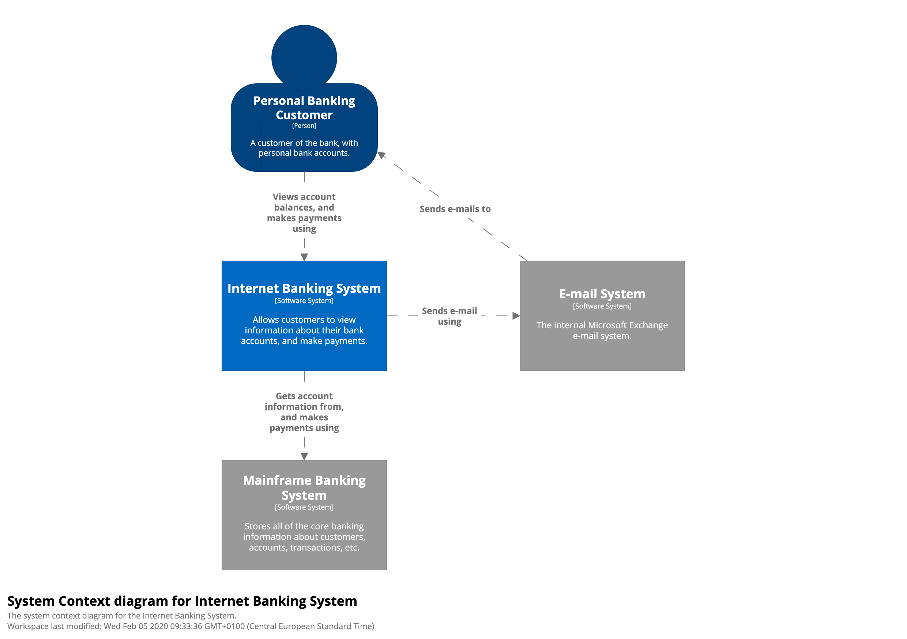

# C4Model JS

The C4 model for visualising software architecture wrapped in a bunch of Javascript tools.

The aim of this repository is to make it easier to store architecture as code and view it dynmaically by providing:

1. **@c4mjs/dsl** _Javascript Library to describe your architecture_
2. **@c4mjs/cli** _Command line utility to convert the js workspace to xml_
3. **[c4model.app](https://c4model.app/)** _React App to view your XML workspace as interactive C4 Diagraphs rendered by [Graphviz](https://graphviz.org/)_

All in it can be used to quickly draw a simple C4 Model from code such as the demo `Internet Banking System`

 

The below source would generate the diagram.

```javascript
// workspace.js
const { workspace } = require("@c4mjs/dsl");

const ws = workspace("Big Bank PLC", "1.0.0");

ws.group("Internet Banking System", (g) => {
  const pbc = g.person("Personal Banking Customer", (p) => {
    p.desc = "A customer of the bank, with personal bank accounts.";

    p.calls(ibs, "Views account balances, and makes payments using");
  });

  const ibs = g.system("Internet Banking System", (s) => {
    s.desc = "Allows customers to view information about their bank accountsm and make payments.";

    s.calls(ems, "Sends e-mails using");
    s.calls(mbs, "Gets account information from, and makes payments using");
  });

  const mbs = g.system("Mainframe Banking System", (s) => {
    s.desc = "Stores all of the core banking information about customers, accounts, transactions etc";
    s.external = true;

    s.calls(ems, "Sends e-mail using");
  });

  const ems = g.system("E-mail System", (s) => {
    s.desc = "The internal Microsoft Exchange e-mail system.";
    s.external = true;

    s.calls(pbc, "Sends e-mail to");
  });
});

module.exports = ws;
```

Or it can be used to document maintain an entire architecture with multiple levels of detail up to level 3.

See [Full Example](https://github.com/JonathanTurnock/c4mjs/tree/main/examples/big-bank-plc-full/src) where system components are
broken out into individual files


## Note about a code first DSL

We did contemplate writing a DSL for documenting the architecture and providing a CLI to parse it, however when it 
comes to managing complex system architectures Objects,Variables and References are your best friend.

So we decided to use a collection of constructs in typescript to give great type hinting and IntelliSense to smooth the process
and leave it up to you how to manage those code files. See the full example to see how powerful this concept can be when it comes 
to modularising the fragments.

The JS DSL tooling procuces a workspace exchange file, this is used by [c4model.app](https://c4model.app/) to render the workspace.

It looks something like the following:
```xml
<Workspace name="Big Bank PLC" version="1.0.0">
	<Group name="Internet Banking System">
		<Person id="personalBankingCustomer-664063" name="Personal Banking Customer" desc="A customer of the bank, with personal bank accounts.">
			<Relationship sender="personalBankingCustomer-664063" recipient="internetBankingSystem-588768" action="Views account balances, and makes payments using"/>
		</Person>
		<System id="internetBankingSystem-588768" name="Internet Banking System" desc="Allows customers to view information about their bank accountsm and make payments.">
			<Relationship sender="internetBankingSystem-588768" recipient="eMailSystem-565361" action="Sends e-mails using"/>
			<Relationship sender="internetBankingSystem-588768" recipient="mainframeBankingSystem-457415" action="Gets account information from, and makes payments using"/>
			<Container id="webApplication-400973" name="Web Application" desc="Delivers the static content and the Internet Banking single page application." tech="Java and Spring MVC">
				<Relationship sender="personalBankingCustomer-664063" recipient="webApplication-400973" action="Visits bigbank.com/ib using"/>
				<Relationship sender="webApplication-400973" recipient="singlePageApplication-945283" action="Delivers to the customers web browser"/>
			</Container>
			...
	</Group>
</Workspace>
```
## Getting Started

First task is to Author a `workspace.xml` file, this is done by either creating one by hand, creating your own tool to make one or use our JS DSL to generate one.

See the [Author](./AUTHOR.md) guide on how to create Workspace files using the JS DSL.

With the `workspace.xml` generated see the [Viewer](./VIEWER.md) guide to see how to view the C4 Model Diagrams.

# Thanks

- Big thanks for the Authors of the [C4Model](https://c4model.com/)
- Highly recommend watching the [C4Model presentation](https://www.youtube.com/watch?v=x2-rSnhpw0g) to get a solid understanding of the concepts