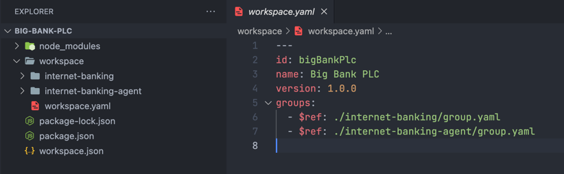

# Authoring

The goal of the Authoring workflow is to produce a bundled workspace file which is hosted and [c4model.app](https://c4model.app) reads at read time.

## Getting Started

Create a new folder to get started

```shell
mkdir ~/Projects/big-bank-plc
```

### Using the CLI

Inside your new project folder run the init command using the c4mjs cli.

```shell
npm i -g @c4mjs/cli && c4mjs init
```

Or

```shell
npx @c4mjs/cli init
```

This will bootstrap a new project.

### Copying example

Alternativly copy one of the examples

https://github.com/c4mjs/c4mjs/tree/main/examples

## The Workspace

The workspace is composed of the `package.json` and `workspace.yaml`



The `workspace.yaml` defines the workspace, for a detailed breakdown of its configuration see the [Workspace](./source-workspace-definitions-workspace) guide

```yaml
# yaml-language-server: $schema=https://raw.githubusercontent.com/c4mjs/c4mjs/main/packages/cli/src/source-workspace.schema.json#/definitions/SourceWorkspaceDto
---
```

## Building

Once you have a new project folder started run install and build to compile it

```shell
npm install && npm run build
```

This will now generate a `workspace.json` file in the folders root.

## Serving

With the `workspace.json` workspace bundled, you need to expose it so it can be read by the app.

The App will call out to the address provided to fetch the workspace file.

> TIP: watch out for CORS issues

Useful deployments are places like Github where the raw content url can be used, or anywhere it can be served from.

For local development we use `http-server` which can serve up the `workspace.json` from the local file system, serve it by
running 

```shell
npx http-server -p 9876 --cors -c-1
```

And visiting http://localhost:9876/workspace.json

